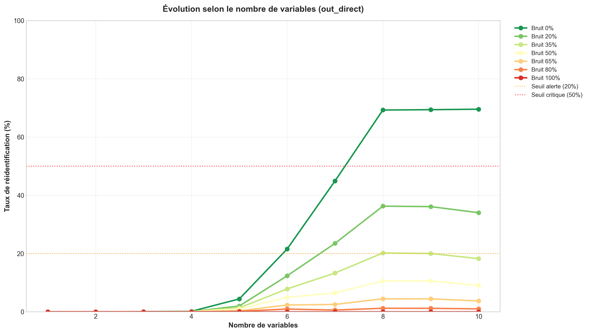
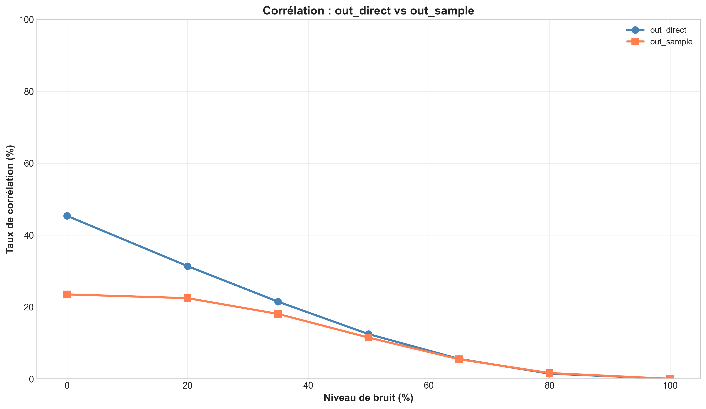
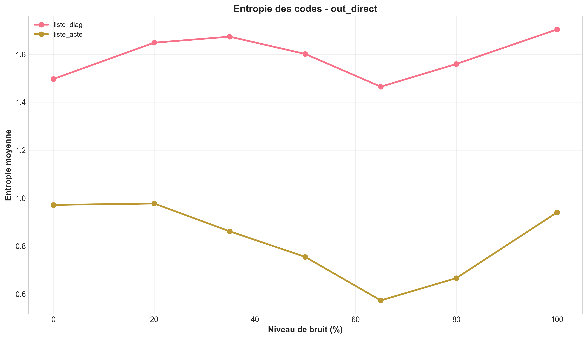

# Sécurité des données de santé : risques de ré-identification

Projet académique (Master 2 MIAS, Centrale Lille) évaluant les risques de ré-identification de données de santé anonymisées, dans le cadre du RGPD et des recommandations du G29 (WP29).

**Auteurs :** Yassin Baali, Gabrielle Caneval

## Objectif

Mesurer, sur un jeu de données de séjours hospitaliers anonymisé (âges regroupés en tranches, dates généralisées, etc.), le risque qu'un attaquant parvienne à ré-identifier un individu en croisant les quasi-identifiants disponibles avec des connaissances externes.

## Aperçu

| Individualisation | Corrélation | Inférence (entropie) |
|---|---|---|
|  |  |  |

## Approche

- **`individualisation.py`**, indicateur d'individualisation : proportion d'enregistrements uniques (donc potentiellement ré-identifiables) selon la combinaison de quasi-identifiants retenue.
- **`correlation.py`**, analyse de corrélation entre variables pour identifier les combinaisons de champs les plus discriminantes.
- **`inference.py`**, attaque par inférence (k-plus proches voisins) : reconstruction d'attributs sensibles à partir des quasi-identifiants et de connaissances externes.
- **`organiser.py`**, script utilitaire d'organisation des fichiers de données et de figures.

## Résultats

Les figures produites (`resultats_individualisation/`, `resultats_correlation/`, `resultats_inference/`) quantifient le risque de ré-identification selon le niveau de généralisation des données, et illustrent l'arbitrage entre utilité statistique et protection de la vie privée.

## Stack technique

Python · pandas · NumPy · Matplotlib · Seaborn · k-NN (scikit-learn)

---

*Le jeu de données brut n'est pas publié dans ce dépôt (données de santé, même anonymisées).*
